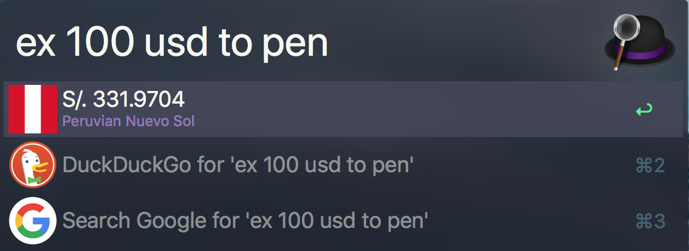

# Alfred workflow to exchange currency

## Requirements

- Python2

## Services

- https://free.currencyconverterapi.com

## Icons

- Currency flag icons from https://github.com/transferwise/currency-flags 
- App icon https://www.iconfinder.com/icons/330400/arrows_connection_move_replication_transfer_transfer_money_icon#size=128

## Usage examples

`ex 100 pen to usd` -> This will show value in USD

# Screenshots

